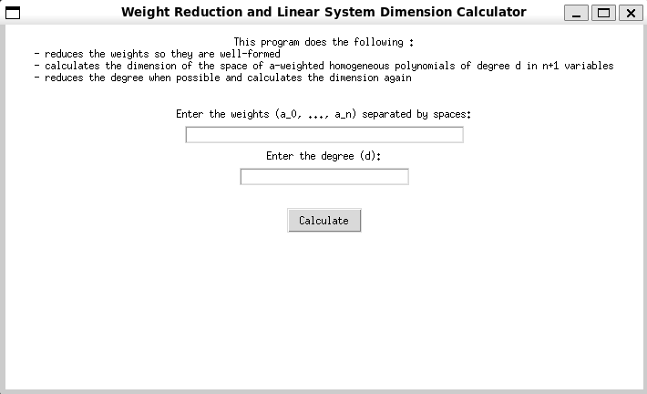
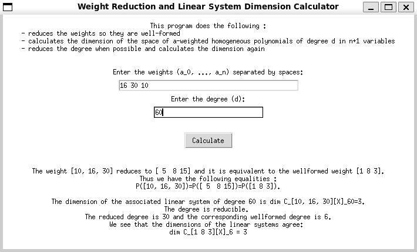

# Weighted Projective Tools

**WeightedProjectiveTools** is a Python project designed to provide tools and functionalities related to weighted projective geometry. Specifically, given a weighted projective space $\mathbf{P}(a_0,\dots,a_n)$ it calculates its well-formed version following section $\S 3.\text{C}$ of [[BelRo]](https://archive.mpim-bonn.mpg.de/id/eprint/3900/1/preprint_1985_16.pdf). It also calculates the dimension of $\mathbf{C}_{(a_0,\dots,a_n)}[x_0,\dots,x_n]_d$ the weighted homogeneous polynomials of degree $d$.  The later is done using a formula I found and prooved as part of my master's thesis entitled *"The Dimension of Linear Systems on Weighted Projective Varieties"*.

## Features
- **Graphical Interface**: The `GraphicalInterface.py` module offers a user-friendly interface for interacting with the tools.
- **Core Functionalities**: The `WeightedProjTools.py` module contains the primary functions and classes for weight reduction and dimension calculation.


## Installation

Clone the project and move to the project directory

```bash
  git clone https://github.com/van512/WeightedProjectiveTools
  cd WeightedProjectiveTools
```

Create a new conda environment named `wpsenv` and activate it
```bash
  conda create -n wpsenv
  conda activate wpsenv
```
Setup the environment by installing the necessary libraries

```bash
  conda install numpy, sympy
```
Or directly create the environment from the requirements.txt file

```bash
  conda create --name wpsenv --file requirements.txt
```
If you want to try the examples in the notebook also install jupyter

```bash
  conda install jupyter
```


## Usage/Examples

1. After installation, you can start the graphical interface by running:
```bash
python GraphicalInterface.py
```
The following window appears.



Fill in the weights and degree and click calculate. For example for weights (16 30 10) and degree 60 the window now shows the calculation results :



2. For direct usage of the functions and classes in `WeightedProjTools.py` open and run the `examples.ipynb` file in jupyter notebooks. 

## License